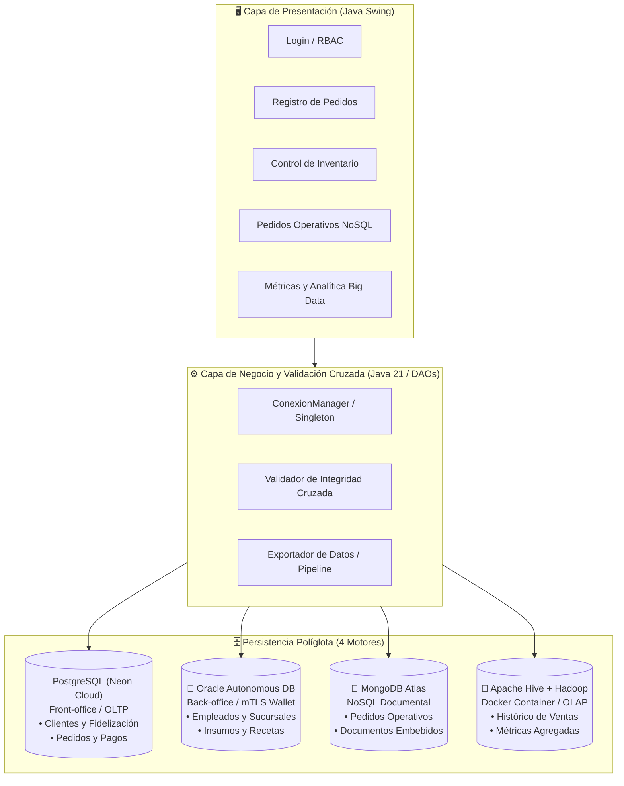
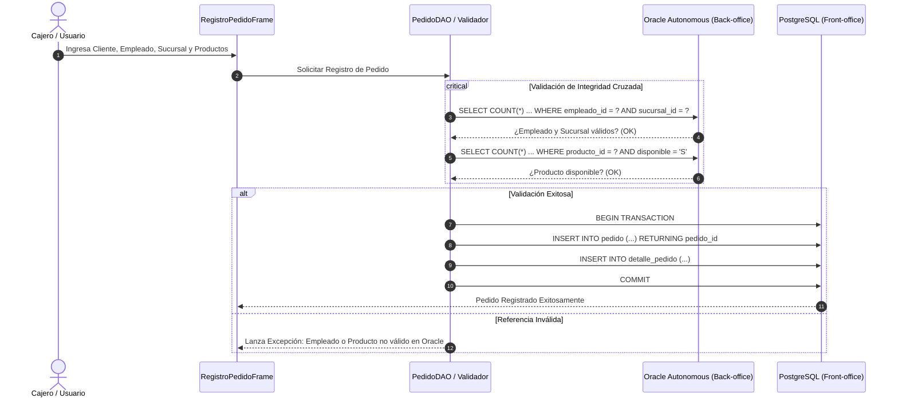

# 🍽️ Sistema de Gestión de Restaurante — Arquitectura Multi-Motor (Persistencia Políglota)

[](https://www.oracle.com/java/)
[](https://maven.apache.org/)
[](https://neon.tech/)
[](https://www.oracle.com/cloud/)
[](https://www.mongodb.com/atlas)
[](https://hive.apache.org/)
[](https://www.docker.com/)

---

## 📌 Descripción General

Este proyecto implementa un **Sistema Integral de Gestión y Analítica para una Cadena de Restaurantes** basado en el patrón de **Persistencia Políglota (Polyglot Persistence)** y **Bases de Datos Distribuidas**. 

En lugar de utilizar un único motor monolítico, el sistema desacopla los diferentes dominios del negocio en cuatro motores de bases de datos especializados (Relacional Transaccional OLTP, Relacional Empresarial con mTLS, NoSQL Orientado a Documentos y Data Warehouse/OLAP Big Data), coordinados desde una aplicación de escritorio desarrollada en **Java 21 con Swing**.

---

## 🏗️ Arquitectura del Ecosistema de Datos



### 🎯 Distribución de Dominios y Justificación Tecnológica

| Motor | Tipo / Entorno | Dominio de Negocio | Justificación de Elección |
| :--- | :--- | :--- | :--- |
| **PostgreSQL** | Relacional OLTP *(Neon Cloud)* | **Front-office:** Clientes, Métodos de Pago, Pedidos, Detalle de Pedidos, Fidelización y Puntos. | Transaccionalidad ACID rápida, alta concurrencia en atención a clientes y triggers de fidelización. |
| **Oracle Autonomous DB** | Relacional Empresarial *(Oracle Cloud con mTLS Wallet)* | **Back-office:** Empleados, Cargos, Sucursales, Horarios, Asistencias, Insumos y Movimientos de Stock. | Alta seguridad empresarial, integridad estricta en inventarios y ejecución de procedimientos PL/SQL. |
| **MongoDB Atlas** | NoSQL Documental *(Cloud Atlas)* | **Operativo de Cocina:** Pedidos en tiempo real con detalle de productos e ingredientes embebidos. | Estructura flexible tipo documento BSON/JSON, lectura rápida de pedidos completos sin necesidad de JOINs. |
| **Apache Hive / Hadoop** | Data Warehouse / OLAP *(Docker Local)* | **Analítica Big Data:** Ventas históricas consolidadas por sucursal y periodos de tiempo. | Procesamiento analítico escalable sobre HDFS para consultas masivas de reportería gerencial. |

---

## ⚡ Validación Cruzada (Cross-Engine Data Integrity)

En una arquitectura políglota distribuida, **no existen Foreign Keys físicas entre motores distintos**. Para evitar inconsistencias (por ejemplo, registrar en PostgreSQL un pedido con un empleado o insumo inexistente en Oracle), el sistema implementa **Validación Cruzada a nivel de Aplicación**:



---

## 🔐 Seguridad y Control de Acceso por Roles (RBAC)

La aplicación implementa control de acceso en la interfaz gráfica y en base de datos según el rol asignado al usuario autenticado:

| Módulo / Pantalla | Administrador (`ADMIN`) | Supervisor (`SUPERVISOR`) | Cajero (`CAJERO`) | Cocinero (`COCINERO`) |
| :--- | :---: | :---: | :---: | :---: |
| **Registro de Pedidos (Postgres + Oracle)** | ✅ | ✅ | ✅ | ❌ |
| **Inventario e Insumos (Oracle PL/SQL)** | ✅ | ✅ | ❌ | ❌ |
| **Pedidos Operativos (MongoDB Atlas)** | ✅ | ✅ | ✅ | ✅ |
| **Reportes y Analítica (Apache Hive)** | ✅ | ✅ | ❌ | ❌ |
| **Gestión y Matriz de Roles** | ✅ | ❌ | ❌ | ❌ |

---

## 📂 Estructura del Proyecto

```
proy_DB2/
├── src/main/java/com/restaurante/
│   ├── Main.java                          # Punto de entrada de la aplicación
│   ├── conexion/
│   │   ├── ConfiguracionConexiones.java   # Gestor desacoplado de credenciales
│   │   └── ConexionManager.java           # Singleton multi-conexión
│   ├── dao/                               # Data Access Objects para cada motor
│   │   ├── ClienteDAO.java                # Acceso a PostgreSQL
│   │   ├── EmpleadoDAO.java               # Acceso a Oracle
│   │   ├── InventarioDAO.java             # Procedimientos PL/SQL Oracle
│   │   ├── PedidoDAO.java                 # Transacciones cruzadas Postgres-Oracle
│   │   ├── PedidoMongoDAO.java            # Colecciones BSON en MongoDB
│   │   ├── ProductoDAO.java               # Catálogo en Oracle
│   │   └── VentasHiveDAO.java             # Queries analíticas en Hive
│   ├── modelo/                            # Entidades POJO y modelos de datos
│   ├── util/                              # Validadores y utilidades de exportación
│   └── vista/                             # Interfaces gráficas Swing (JFrames)
├── files/
│   ├── 01_Modelado_Datos.md               # Especificación del modelo entidad-relación
│   ├── 02_PostgreSQL_Script.sql           # DDL, DML, Triggers y Roles de Front-office
│   ├── 03_Oracle_Script.sql               # DDL, DML, Funciones y Procedimientos PL/SQL
│   ├── 04_NoSQL_BigData.md                # Configuración MongoDB y Apache Hive
│   ├── 05_Normalizacion_1FN_2FN_3FN.md    # Justificación de normalización
│   └── docker-compose.yml                 # Clúster Hadoop + Hive en contenedores
├── config.properties.example              # Plantilla pública de variables de conexión
├── pom.xml                                # Dependencias Maven (Drivers JDBC, BSON, etc.)
└── README.md
```

---

## 🚀 Guía de Instalación y Ejecución

### 1. Requisitos Previos
* **Java Development Kit (JDK):** Versión 21 o superior.
* **Apache Maven:** 3.9+ (o utilizar el wrapper incluido `./mvnw.cmd`).
* **Docker & Docker Desktop:** Para levantar el clúster Hadoop/Hive.
* **Credenciales de Nube:** Acceso a Neon PostgreSQL, Oracle Cloud Autonomous (Wallet) y MongoDB Atlas.

### 2. Clonar el Repositorio
```bash
git clone https://github.com/tu-usuario/restaurante-multimotor.git
cd restaurante-multimotor
```

### 3. Configurar Variables de Conexión
Copia la plantilla `config.properties.example` a `config.properties`:
```bash
cp config.properties.example config.properties
```
Edita `config.properties` con tus cadenas de conexión y credenciales:
```properties
# PostgreSQL (Neon Cloud)
PG_URL=jdbc:postgresql://<HOST_NEON>:5432/neondb?sslmode=require
PG_ADMIN_USER=neondb_owner
PG_ADMIN_PASS=tu_password

# Oracle Cloud Autonomous (mTLS Wallet)
ORA_URL=jdbc:oracle:thin:@<TNS_ALIAS>?TNS_ADMIN=./wallet
ORA_USER=admin
ORA_PASS=tu_password

# MongoDB Atlas
MONGO_URI=mongodb+srv://<USER>:<PASS>@<CLUSTER>.mongodb.net/restaurante_nosql
MONGO_DB_NAME=restaurante_nosql

# Apache Hive (Docker)
HIVE_URL=jdbc:hive2://localhost:10000/default
```

### 4. Iniciar el Entorno Big Data (Apache Hive en Docker)
```bash
docker compose -f files/docker-compose.yml up -d
```

### 5. Compilar y Ejecutar la Aplicación
Con Maven Wrapper:
```bash
# En Windows:
.\mvnw.cmd clean compile
.\mvnw.cmd exec:java

# En Linux / macOS:
./mvnw clean compile
./mvnw exec:java
```

---

## 📸 Demostración de Pantallas (UI)

* **Login con RBAC:** Autenticación y habilitación condicional de paneles según permisos.
* **Registro de Pedido:** Selección de datos cruzados y validación transaccional en vivo.
* **Semáforo de Inventario:** Renderizado visual con alerta roja para insumos por debajo del stock mínimo (`Oracle`).
* **Visor Documental MongoDB:** Inspección en tiempo real de pedidos con sub-documentos embebidos.
* **Dashboard Analítico Hive:** Ejecución de queries agregadas de ventas históricas procesadas en Hadoop.

---

## 👨‍💻 Autor

* **Gianfranco Soto Paz** — *Diseño de Arquitectura de Datos, Implementación Multi-Motor y Desarrollo Java*
  * 💼 [LinkedIn](https://www.linkedin.com/) | 🌐 [Portafolio](https://github.com/)

---

## 📄 Licencia

Este proyecto se encuentra bajo la licencia **MIT** — puedes consultar el archivo [LICENSE](LICENSE) para más detalles.
