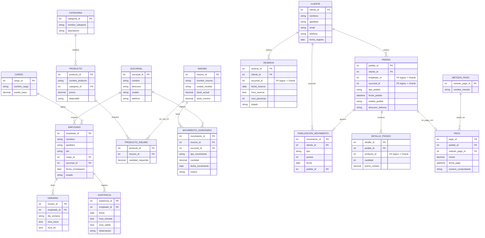

# Artefacto 1 — Modelado de Datos
## Sistema Integral de Gestión para Cadena de Restaurantes

---

## 0. Decisión de arquitectura (léelo antes de copiar al Word)

El proyecto exige usar **PostgreSQL y Oracle al mismo tiempo**. Como un motor no puede tener
una Foreign Key física apuntando a una tabla de otro motor, el diseño se divide así:

| Motor | Dominio que administra | Justificación |
|---|---|---|
| **Oracle** | Back-office: Empleados, Sucursales, Productos, Inventario | Dominio "catálogo/ERP", cambia poco, encaja con el uso tradicional empresarial de Oracle |
| **PostgreSQL** | Front-office: Clientes, Reservas, Pedidos, Pagos, Fidelización | Dominio OLTP de alta escritura (cada pedido, cada pago), encaja con el perfil web/operacional de Postgres |

Las columnas que cruzan de un motor a otro (ej. `Pedido.empleado_id`, `Pedido.producto_id`)
**se guardan como simples enteros, sin constraint FK física**, y la integridad referencial
se valida **desde la capa Java (DAO)** antes de insertar — esto es justamente lo que vas a
explicar en la sustentación como "integridad referencial distribuida a nivel de aplicación".
(Opcional avanzado, menciónalo si quieres nota extra: existe `oracle_fdw` para que Postgres
"vea" tablas de Oracle como si fueran locales — se puede comentar como mejora futura).

---

## 1. Modelo Entidad-Relación (Mermaid.js)

Pega este bloque en cualquier visor Mermaid (mermaid.live) o en Notion/Markdown con soporte
Mermaid para exportar la imagen y pegarla en tu Word.

---

## 2. Modelo Lógico

### Módulo Empleados / Sucursales (Oracle)

| Tabla | Columna | Tipo lógico | Llave |
|---|---|---|---|
| SUCURSAL | sucursal_id | Entero | PK |
| | nombre, direccion, ciudad, telefono | Texto | |
| CARGO | cargo_id | Entero | PK |
| | nombre_cargo | Texto | |
| | sueldo_base | Decimal | |
| EMPLEADO | empleado_id | Entero | PK |
| | dni | Texto (único) | |
| | cargo_id | Entero | FK → CARGO |
| | sucursal_id | Entero | FK → SUCURSAL |
| HORARIO | horario_id | Entero | PK |
| | empleado_id | Entero | FK → EMPLEADO |
| ASISTENCIA | asistencia_id | Entero | PK |
| | empleado_id | Entero | FK → EMPLEADO |

### Módulo Productos / Inventario (Oracle)

| Tabla | Columna | Tipo lógico | Llave |
|---|---|---|---|
| CATEGORIA | categoria_id | Entero | PK |
| PRODUCTO | producto_id | Entero | PK |
| | categoria_id | Entero | FK → CATEGORIA |
| INSUMO | insumo_id | Entero | PK |
| PRODUCTO_INSUMO | producto_id | Entero | PK compuesta / FK → PRODUCTO |
| | insumo_id | Entero | PK compuesta / FK → INSUMO |
| MOVIMIENTO_INVENTARIO | movimiento_id | Entero | PK |
| | insumo_id | Entero | FK → INSUMO |
| | sucursal_id | Entero | FK → SUCURSAL |

### Módulo Clientes / Fidelización (PostgreSQL)

| Tabla | Columna | Tipo lógico | Llave |
|---|---|---|---|
| CLIENTE | cliente_id | Entero | PK |
| | email | Texto (único) | |
| FIDELIZACION_MOVIMIENTO | movimiento_id | Entero | PK |
| | cliente_id | Entero | FK → CLIENTE |
| | pedido_id | Entero | FK → PEDIDO |

> Nota anti-redundancia: **no** se guarda `puntos_totales` en CLIENTE. Los puntos se calculan
> con `SUM(puntos)` sobre `FIDELIZACION_MOVIMIENTO` mediante una vista — así nunca queda
> desincronizado.

### Módulo Pedidos / Pagos / Reservas (PostgreSQL)

| Tabla | Columna | Tipo lógico | Llave |
|---|---|---|---|
| RESERVA | reserva_id | Entero | PK |
| | cliente_id | Entero | FK → CLIENTE |
| | sucursal_id | Entero | **FK lógica** → Oracle.SUCURSAL |
| PEDIDO | pedido_id | Entero | PK |
| | cliente_id | Entero | FK → CLIENTE |
| | empleado_id | Entero | **FK lógica** → Oracle.EMPLEADO |
| | sucursal_id | Entero | **FK lógica** → Oracle.SUCURSAL |
| DETALLE_PEDIDO | detalle_id | Entero | PK |
| | pedido_id | Entero | FK → PEDIDO |
| | producto_id | Entero | **FK lógica** → Oracle.PRODUCTO |
| | precio_unitario | Decimal | (snapshot histórico del precio al momento del pedido — no es redundancia, es trazabilidad) |
| METODO_PAGO | metodo_pago_id | Entero | PK |
| PAGO | pago_id | Entero | PK |
| | pedido_id | Entero | FK → PEDIDO (único) |
| | metodo_pago_id | Entero | FK → METODO_PAGO |

---

## 3. Modelo Físico (tipos reales por motor)

### Oracle (tipos físicos)

| Tipo lógico | Tipo físico Oracle |
|---|---|
| Entero (autoincremental) | `NUMBER` + `GENERATED ALWAYS AS IDENTITY` |
| Texto corto | `VARCHAR2(n)` |
| Decimal | `NUMBER(p,s)` |
| Fecha | `DATE` |
| Hora | `VARCHAR2(5)` o `TIMESTAMP` (Oracle no tiene tipo TIME puro) |
| Texto largo | `CLOB` |

### PostgreSQL (tipos físicos)

| Tipo lógico | Tipo físico PostgreSQL |
|---|---|
| Entero (autoincremental) | `SERIAL` / `BIGSERIAL` |
| Texto corto | `VARCHAR(n)` |
| Decimal | `NUMERIC(p,s)` |
| Fecha | `DATE` |
| Hora | `TIME` |
| Fecha+hora | `TIMESTAMP` |
| Texto largo | `TEXT` |
| JSON (si lo necesitas) | `JSONB` |

El detalle exacto columna por columna ya está aplicado en los scripts DDL de los
Artefactos 2 (PostgreSQL y Oracle) — ahí puedes ver el `CREATE TABLE` real para tus capturas.
