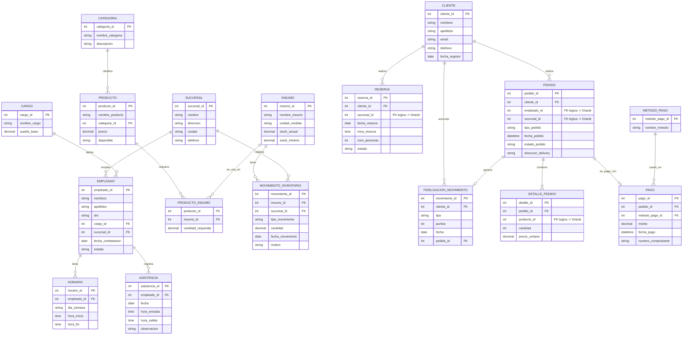

# Sistema Integral de Gestión para una Cadena de Restaurantes

**Curso:** [DATO FALTANTE: nombre completo del curso, e.g. Base de Datos II]
**Docente:** [DATO FALTANTE: nombre del docente]
**Integrantes:** [DATO FALTANTE: nombres completos de los integrantes del grupo]
**Grupo:** [DATO FALTANTE: número o identificador de grupo]
**Fecha de entrega:** [DATO FALTANTE: fecha de entrega del documento]
**Ciclo académico:** [DATO FALTANTE: ciclo académico, e.g. 2026-I]

---

## I. Descripción General del Caso

El presente proyecto corresponde al desarrollo de un sistema integral de gestión operativa diseñado para una cadena de restaurantes con múltiples sucursales. El sistema aborda la problemática de administrar de manera unificada los procesos de back-office (gestión de empleados, productos, inventario y sucursales) y front-office (clientes, pedidos, pagos, reservas y fidelización) mediante una arquitectura multi-motor de bases de datos.

El escenario plantea un entorno distribuido en el que distintos motores de bases de datos coexisten de forma simultánea, cada uno especializado en un dominio funcional específico. En concreto, se emplean cuatro tecnologías de almacenamiento: **Oracle** para el dominio empresarial/back-office, **PostgreSQL** para el dominio transaccional/front-office, **MongoDB** como almacén documental NoSQL para consultas operativas ágiles, y **Apache Hive sobre Hadoop** para el procesamiento analítico de datos históricos de ventas (componente Big Data).

La aplicación de escritorio, desarrollada en Java Swing, actúa como capa de integración que conecta y opera sobre las cuatro fuentes de datos de manera transparente para el usuario, garantizando la integridad referencial entre motores mediante validaciones a nivel de aplicación y ofreciendo un sistema de autenticación basado en roles con permisos diferenciados.

---

## II. Objetivos del Proyecto

1. **Diseñar e implementar una arquitectura de bases de datos multi-motor** que distribuya los dominios funcionales de un sistema de restaurantes entre Oracle y PostgreSQL, justificando técnicamente la asignación de cada dominio a su motor correspondiente.

2. **Garantizar la integridad referencial en un entorno distribuido** mediante mecanismos de validación cruzada a nivel de aplicación, dado que las restricciones de llave foránea física no son posibles entre motores de bases de datos distintos.

3. **Implementar un componente NoSQL** basado en MongoDB que almacene documentos embebidos de pedidos operativos y recetas, demostrando el uso adecuado de un modelo documental frente al modelo relacional para patrones de acceso específicos.

4. **Desarrollar un componente de Big Data** utilizando Apache Hive sobre un clúster Hadoop desplegado en Docker, que procese consultas analíticas sobre datos históricos de ventas exportados desde PostgreSQL.

5. **Construir una aplicación de escritorio funcional en Java Swing** que integre las cuatro fuentes de datos, implemente autenticación por roles con control de acceso diferenciado y permita la operación en vivo durante la sustentación del proyecto.

6. **Aplicar buenas prácticas de seguridad y administración de bases de datos**, incluyendo la creación de roles y permisos granulares en Oracle y PostgreSQL, así como procedimientos documentados de backup y restore para cada motor.

---

## III. Arquitectura de la Solución

### III.1 Distribución de dominios por motor

La distribución de los dominios funcionales entre los distintos motores de bases de datos se realizó conforme a la siguiente tabla:

| Motor de BD         | Dominio funcional       | Tablas / Colecciones                                                                                                      |
|----------------------|------------------------|----------------------------------------------------------------------------------------------------------------------------|
| **Oracle**           | Back-office (ERP)      | `sucursal`, `cargo`, `empleado`, `horario`, `asistencia`, `categoria`, `producto`, `insumo`, `producto_insumo`, `movimiento_inventario` |
| **PostgreSQL**       | Front-office (OLTP)    | `cliente`, `metodo_pago`, `reserva`, `pedido`, `detalle_pedido`, `pago`, `fidelizacion_movimiento`                         |
| **MongoDB Atlas**    | NoSQL documental       | Colecciones: `pedidos_operativos`, `recetas`                                                                                |
| **Hive / Hadoop**    | Big Data analítico     | Tabla externa: `ventas_hist`                                                                                                |

Las conexiones se gestionan desde la clase `ConfiguracionConexiones.java`, que centraliza las cadenas de conexión para los cuatro motores:

- **PostgreSQL:** Servicio en la nube Neon (`jdbc:postgresql://<HOST_NEON_POSTGRES>/neondb?sslmode=require`)
- **Oracle:** Autonomous Database en Oracle Cloud, con autenticación mediante Wallet (`jdbc:oracle:thin:@<TNS_ALIAS>?TNS_ADMIN=...`)
- **MongoDB:** Clúster en MongoDB Atlas (`mongodb+srv://<USER>:<PASS>@<CLUSTER>.mongodb.net/restaurante_nosql`)
- **Hive:** Contenedor Docker local en el puerto 10000 (`jdbc:hive2://localhost:10000/default`)

### III.2 Justificación de las decisiones de diseño

**Oracle para back-office:** El dominio de gestión de empleados, sucursales, productos e inventario se caracteriza por ser un catálogo de baja volatilidad con operaciones predominantemente de lectura y actualizaciones controladas. Oracle, como motor empresarial de referencia, ofrece soporte nativo para procedimientos almacenados PL/SQL (utilizado en `sp_registrar_salida_insumo`), funciones de verificación de disponibilidad (`fn_disponibilidad_producto`), y un sistema robusto de roles y permisos a nivel de esquema.

**PostgreSQL para front-office:** El dominio de pedidos, pagos y fidelización implica un perfil OLTP de alta escritura, con inserciones transaccionales frecuentes (cada pedido, cada pago). PostgreSQL, con su soporte avanzado para funciones PL/pgSQL (utilizado en `fn_registrar_pedido`), triggers automáticos (`trg_acumular_puntos` para fidelización), columnas generadas (`subtotal` en `detalle_pedido`) y arrays como parámetros de funciones, se adapta eficientemente a este patrón de carga.

**Integridad referencial distribuida:** Dado que un motor de bases de datos no puede declarar una restricción `FOREIGN KEY` física apuntando a una tabla de otro motor, las columnas que cruzan dominios (`pedido.empleado_id` → Oracle, `pedido.sucursal_id` → Oracle, `detalle_pedido.producto_id` → Oracle) se almacenan como enteros simples sin constraint FK. La integridad referencial se valida en la capa de aplicación Java, específicamente en el método `validarReferenciasEnOracle()` de la clase `PedidoDAO`, que consulta Oracle antes de permitir la inserción en PostgreSQL. Este patrón se denomina **integridad referencial distribuida a nivel de aplicación**.

**MongoDB para consultas operativas:** Las colecciones de MongoDB no constituyen una réplica de las tablas relacionales, sino que responden a un patrón de acceso diferente: la lectura rápida de un pedido completo con su detalle embebido (sin necesidad de JOINs), ideal para un dashboard de cocina o una aplicación de delivery.

**Hive sobre Hadoop para analítica:** La elección de Hive permite ejecutar consultas SQL sobre datos almacenados en HDFS, procesadas internamente como trabajos MapReduce. Esto brinda capacidad de análisis sobre volúmenes de datos históricos sin afectar las bases de datos transaccionales.

---

## IV. Modelo de Datos

### IV.1 Modelo Entidad-Relación

El modelo entidad-relación se divide en dos dominios claramente diferenciados. A continuación se presenta la representación Mermaid del diagrama ER completo (renderizar en mermaid.live o en un visor compatible para exportar la imagen):



> 📎 EVIDENCIA REQUERIDA: Diagrama ER renderizado como imagen (exportar desde mermaid.live o visor compatible)

### IV.2 Modelo Lógico

#### Módulo Empleados / Sucursales (Oracle)

| Tabla | Columna | Tipo lógico | Llave |
|---|---|---|---|
| SUCURSAL | sucursal_id | Entero (autoincremental) | PK |
| | nombre | Texto (100) | |
| | direccion | Texto (200) | |
| | ciudad | Texto (60) | |
| | telefono | Texto (20) | |
| CARGO | cargo_id | Entero (autoincremental) | PK |
| | nombre_cargo | Texto (50, único) | |
| | sueldo_base | Decimal (10,2) | |
| EMPLEADO | empleado_id | Entero (autoincremental) | PK |
| | nombres | Texto (80) | |
| | apellidos | Texto (80) | |
| | dni | Texto (15, único) | |
| | cargo_id | Entero | FK → CARGO |
| | sucursal_id | Entero | FK → SUCURSAL |
| | fecha_contratacion | Fecha | |
| | estado | Texto (10) | CHECK: ACTIVO, INACTIVO |
| HORARIO | horario_id | Entero (autoincremental) | PK |
| | empleado_id | Entero | FK → EMPLEADO |
| | dia_semana | Texto (10) | |
| | hora_inicio | Texto (5) | |
| | hora_fin | Texto (5) | |
| ASISTENCIA | asistencia_id | Entero (autoincremental) | PK |
| | empleado_id | Entero | FK → EMPLEADO |
| | fecha | Fecha | |
| | hora_entrada | Texto (5) | |
| | hora_salida | Texto (5) | |
| | observacion | Texto (200) | |

#### Módulo Productos / Inventario (Oracle)

| Tabla | Columna | Tipo lógico | Llave |
|---|---|---|---|
| CATEGORIA | categoria_id | Entero (autoincremental) | PK |
| | nombre_categoria | Texto (50, único) | |
| | descripcion | Texto (200) | |
| PRODUCTO | producto_id | Entero (autoincremental) | PK |
| | nombre_producto | Texto (100) | |
| | categoria_id | Entero | FK → CATEGORIA |
| | precio | Decimal (8,2) | |
| | disponible | Texto (1) | CHECK: S, N |
| INSUMO | insumo_id | Entero (autoincremental) | PK |
| | nombre_insumo | Texto (100) | |
| | unidad_medida | Texto (15) | |
| | stock_actual | Decimal (10,2) | Default: 0 |
| | stock_minimo | Decimal (10,2) | Default: 0 |
| PRODUCTO_INSUMO | producto_id | Entero | PK compuesta / FK → PRODUCTO |
| | insumo_id | Entero | PK compuesta / FK → INSUMO |
| | cantidad_requerida | Decimal (8,2) | |
| MOVIMIENTO_INVENTARIO | movimiento_id | Entero (autoincremental) | PK |
| | insumo_id | Entero | FK → INSUMO |
| | sucursal_id | Entero | FK → SUCURSAL |
| | tipo_movimiento | Texto (8) | CHECK: ENTRADA, SALIDA |
| | cantidad | Decimal (10,2) | |
| | fecha_movimiento | Fecha | Default: SYSDATE |
| | motivo | Texto (200) | |

#### Módulo Clientes / Fidelización (PostgreSQL)

| Tabla | Columna | Tipo lógico | Llave |
|---|---|---|---|
| CLIENTE | cliente_id | Entero (autoincremental) | PK |
| | nombres | Texto (80) | |
| | apellidos | Texto (80) | |
| | email | Texto (120, único) | |
| | telefono | Texto (20) | |
| | fecha_registro | Fecha | Default: CURRENT_DATE |
| FIDELIZACION_MOVIMIENTO | movimiento_id | Entero (autoincremental) | PK |
| | cliente_id | Entero | FK → CLIENTE |
| | tipo | Texto (12) | CHECK: ACUMULACION, REDENCION |
| | puntos | Entero | |
| | fecha | Timestamp | Default: CURRENT_TIMESTAMP |
| | pedido_id | Entero | FK → PEDIDO |

Nota de diseño: no se almacena un campo `puntos_totales` en la tabla CLIENTE. Los puntos vigentes se calculan mediante la vista `vw_puntos_cliente` con `SUM(puntos)` sobre `fidelizacion_movimiento`, lo cual evita la redundancia y posibles desincronizaciones.

#### Módulo Pedidos / Pagos / Reservas (PostgreSQL)

| Tabla | Columna | Tipo lógico | Llave |
|---|---|---|---|
| METODO_PAGO | metodo_pago_id | Entero (autoincremental) | PK |
| | nombre_metodo | Texto (40, único) | |
| RESERVA | reserva_id | Entero (autoincremental) | PK |
| | cliente_id | Entero | FK → CLIENTE |
| | sucursal_id | Entero | **FK lógica** → Oracle.SUCURSAL |
| | fecha_reserva | Fecha | |
| | hora_reserva | Hora (TIME) | |
| | num_personas | Entero pequeño | CHECK: > 0 |
| | estado | Texto (15) | CHECK: CONFIRMADA, CANCELADA, COMPLETADA |
| PEDIDO | pedido_id | Entero (autoincremental) | PK |
| | cliente_id | Entero | FK → CLIENTE |
| | empleado_id | Entero | **FK lógica** → Oracle.EMPLEADO |
| | sucursal_id | Entero | **FK lógica** → Oracle.SUCURSAL |
| | tipo_pedido | Texto (10) | CHECK: SALON, DELIVERY |
| | fecha_pedido | Timestamp | Default: CURRENT_TIMESTAMP |
| | estado_pedido | Texto (15) | CHECK: PENDIENTE, PREPARACION, ENTREGADO, CANCELADO |
| | direccion_delivery | Texto (200) | |
| DETALLE_PEDIDO | detalle_id | Entero (autoincremental) | PK |
| | pedido_id | Entero | FK → PEDIDO (ON DELETE CASCADE) |
| | producto_id | Entero | **FK lógica** → Oracle.PRODUCTO |
| | cantidad | Entero pequeño | CHECK: > 0 |
| | precio_unitario | Decimal (8,2) | Snapshot histórico del precio |
| | subtotal | Decimal (10,2) | Columna generada (cantidad × precio_unitario) |
| PAGO | pago_id | Entero (autoincremental) | PK |
| | pedido_id | Entero (único) | FK → PEDIDO |
| | metodo_pago_id | Entero | FK → METODO_PAGO |
| | monto | Decimal (10,2) | |
| | fecha_pago | Timestamp | Default: CURRENT_TIMESTAMP |
| | numero_comprobante | Texto (30, único) | |

### IV.3 Modelo Físico

#### Tipos físicos en Oracle

| Tipo lógico | Tipo físico Oracle |
|---|---|
| Entero (autoincremental) | `NUMBER` + `GENERATED ALWAYS AS IDENTITY` |
| Texto corto | `VARCHAR2(n)` |
| Decimal | `NUMBER(p,s)` |
| Fecha | `DATE` |
| Hora | `VARCHAR2(5)` (Oracle no posee un tipo TIME nativo) |

#### Tipos físicos en PostgreSQL

| Tipo lógico | Tipo físico PostgreSQL |
|---|---|
| Entero (autoincremental) | `SERIAL` |
| Texto corto | `VARCHAR(n)` |
| Decimal | `NUMERIC(p,s)` |
| Fecha | `DATE` |
| Hora | `TIME` |
| Fecha + hora | `TIMESTAMP` |
| Columna generada | `GENERATED ALWAYS AS (...) STORED` |

---

## V. Implementación en PostgreSQL

### V.1 Estructura de tablas

El esquema de PostgreSQL se encuentra definido en el script `files/02_PostgreSQL_Script.sql`. La base de datos se denomina `neondb` y se aloja en el servicio en la nube Neon. Se crearon las siguientes siete tablas y dos vistas:

**Tablas:** `cliente`, `metodo_pago`, `reserva`, `pedido`, `detalle_pedido`, `pago`, `fidelizacion_movimiento`.

**Vistas:**
- `vw_puntos_cliente`: Calcula los puntos vigentes de cada cliente mediante `SUM(CASE WHEN tipo = 'ACUMULACION' THEN puntos ELSE -puntos END)`, evitando almacenar un total redundante.
- `vw_ventas_pedido`: Une las tablas `pedido` y `pago` para obtener una vista plana de ventas por sucursal, utilizada también como fuente de exportación hacia Hadoop.

La columna `subtotal` de `detalle_pedido` se implementó como columna generada (`GENERATED ALWAYS AS (cantidad * precio_unitario) STORED`), lo cual garantiza la consistencia del cálculo sin intervención de la aplicación.

> 📎 EVIDENCIA REQUERIDA: Captura de pgAdmin mostrando la ejecución exitosa del script DDL y las tablas creadas en el panel de navegación

### V.2 Funciones y procedimientos almacenados

Se implementaron los siguientes objetos programáticos en PostgreSQL:

**Función `fn_registrar_pedido`:** Recibe como parámetros el ID de cliente, empleado, sucursal, tipo de pedido, y tres arrays paralelos (IDs de producto, cantidades y precios). Inserta atómicamente la cabecera del pedido y todos sus detalles en una sola transacción, retornando el `pedido_id` generado.

```sql
CREATE OR REPLACE FUNCTION fn_registrar_pedido(
    p_cliente_id INTEGER,
    p_empleado_id INTEGER,
    p_sucursal_id INTEGER,
    p_tipo VARCHAR,
    p_productos INTEGER[],
    p_cantidades SMALLINT[],
    p_precios NUMERIC[]
) RETURNS INTEGER AS $$
-- Cuerpo: INSERT en pedido + loop INSERT en detalle_pedido
$$ LANGUAGE plpgsql;
```

**Trigger `trg_acumular_puntos`:** Se ejecuta automáticamente después de cada inserción en la tabla `pago`. La función asociada `trg_fn_acumular_puntos()` calcula los puntos de fidelización a razón de 1 punto por cada S/ 10.00 del monto pagado y los inserta en `fidelizacion_movimiento`. Esta automatización elimina la posibilidad de que un pago se registre sin su correspondiente acumulación de puntos.

> Ver script completo en: `files/02_PostgreSQL_Script.sql`

### V.3 Datos de prueba

Se insertaron los siguientes registros de prueba:

| Tabla | Registros | Datos representativos |
|---|---|---|
| metodo_pago | 5 | Efectivo, Tarjeta, Yape, Plin, Transferencia |
| cliente | 3 | Gianella Torres, Renzo Quispe, Camila Flores |
| reserva | 2 | Reservas en Sucursal 1 y 2, fechas de julio 2026 |
| pedido | 2 | Pedido SALON (Suc. 1) y DELIVERY (Suc. 2) |
| pago | 2 | S/ 63.00 con Tarjeta, S/ 35.00 con Yape |

> 📎 EVIDENCIA REQUERIDA: Captura de `SELECT * FROM pedido` y `SELECT * FROM vw_puntos_cliente` mostrando los datos cargados y los puntos acumulados automáticamente por el trigger

---

## VI. Implementación en Oracle

### VI.1 Estructura de tablas

El esquema de Oracle se encuentra definido en el script `files/03_Oracle_Script.sql` y en el script raíz `Proyecto_BDII.sql` (ambos contienen la misma estructura). La base de datos se ejecuta sobre un Oracle Autonomous Database en la nube. Se crearon diez tablas:

**Tablas:** `sucursal`, `cargo`, `empleado`, `horario`, `asistencia`, `categoria`, `producto`, `insumo`, `producto_insumo`, `movimiento_inventario`.

El script incluye un bloque PL/SQL de limpieza previo a la creación, que elimina tablas, roles y usuarios existentes de forma segura (capturando excepciones `SQLCODE != -942` para tablas y `SQLCODE != -1919` para roles inexistentes), lo cual permite su re-ejecución idempotente.

Las claves primarias utilizan `NUMBER GENERATED ALWAYS AS IDENTITY`, que es el equivalente Oracle al `SERIAL` de PostgreSQL.

> 📎 EVIDENCIA REQUERIDA: Captura de Oracle SQL Developer mostrando las tablas creadas en el panel de navegación del esquema

### VI.2 Funciones y procedimientos almacenados

**Procedimiento `sp_registrar_salida_insumo`:** Registra una salida de inventario, actualiza el stock del insumo correspondiente y emite una alerta mediante `DBMS_OUTPUT` si el stock resultante cae por debajo del mínimo configurado. Recibe cuatro parámetros: `p_insumo_id`, `p_sucursal_id`, `p_cantidad` y `p_motivo`. Este procedimiento es invocado desde la aplicación Java a través de la clase `InventarioDAO` mediante un `CallableStatement`:

```java
String sqlCall = "{call sp_registrar_salida_insumo(?, ?, ?, ?)}";
try (CallableStatement cs = conn.prepareCall(sqlCall)) {
    cs.setInt(1, insumoId);
    cs.setInt(2, sucursalId);
    cs.setDouble(3, cantidad);
    cs.setString(4, motivo);
    cs.execute();
}
```

**Función `fn_disponibilidad_producto`:** Evalúa si un producto determinado cuenta con suficiente stock de todos sus insumos requeridos. Retorna `'DISPONIBLE'` o `'NO_DISPONIBLE'` tras verificar si existe al menos un insumo cuyo `stock_actual` sea inferior a la `cantidad_requerida` registrada en `producto_insumo`.

> Ver script completo en: `files/03_Oracle_Script.sql`

### VI.3 Datos de prueba

Se insertaron los siguientes registros de prueba:

| Tabla | Registros | Datos representativos |
|---|---|---|
| sucursal | 2 | Sede Miraflores (Av. Larco 123, Lima), Sede San Borja (Av. Aviación 456, Lima) |
| cargo | 4 | Administrador (S/ 3,500), Supervisor (S/ 2,800), Cajero (S/ 1,500), Cocinero (S/ 1,800) |
| empleado | 4 | Luis Ramirez (Admin, Suc. 1), Maria Castillo (Cajero, Suc. 1), Jorge Salas (Cocinero, Suc. 1), Paola Reyes (Cajero, Suc. 2) |
| categoria | 3 | Entrada, Fondo, Bebida |
| producto | 4 | Causa Limeña (S/ 18.00), Lomo Saltado (S/ 25.50), Chicha Morada (S/ 12.00), Aji de Gallina (S/ 35.00) |
| insumo | 3 | Papa (50 kg, mín. 10), Carne de Res (30 kg, mín. 5), Maiz Morado (15 kg, mín. 3) |
| producto_insumo | 3 | Causa→Papa (0.3 kg), Lomo→Carne (0.25 kg), Chicha→Maiz (0.1 kg) |

> 📎 EVIDENCIA REQUERIDA: Captura de `SELECT * FROM empleado` y `SELECT * FROM producto` en SQL Developer mostrando los datos cargados

---

## VII. Seguridad y Administración

### VII.1 Roles y permisos

Se implementó un esquema de control de acceso basado en roles (RBAC) en ambos motores de bases de datos. Los roles fueron creados mediante sentencias DDL `CREATE ROLE` y los permisos asignados con `GRANT`.

#### Roles en PostgreSQL

| Rol | Permisos concedidos | Alcance |
|---|---|---|
| `rol_admin` | `ALL PRIVILEGES ON ALL TABLES`, `USAGE, SELECT ON ALL SEQUENCES` | Control total sobre el esquema `public` |
| `rol_supervisor` | `SELECT ON ALL TABLES` | Lectura completa (solo consultas) |
| `rol_cajero` | `SELECT, INSERT, UPDATE` en `pedido`, `detalle_pedido`, `pago`; `SELECT` en `cliente`, `metodo_pago`; `USAGE, SELECT ON ALL SEQUENCES` | Gestión operativa de pedidos y pagos |
| `rol_cocinero` | `SELECT, UPDATE (estado_pedido)` en `pedido`; `SELECT` en `detalle_pedido` | Visualización de pedidos y actualización de estado |

Cada rol posee capacidad de login con contraseña propia (e.g., `rol_admin` / `Admin#2026`).

#### Roles en Oracle

| Rol | Permisos concedidos | Alcance |
|---|---|---|
| `rol_admin_ora` | `ALL` en `sucursal`, `empleado`, `producto`, `insumo` | Control total sobre tablas de back-office |
| `rol_supervisor_ora` | `SELECT` en `sucursal`, `empleado`, `producto`, `insumo`, `movimiento_inventario` | Supervisión y monitoreo |
| `rol_cajero_ora` | `SELECT` en `producto`, `categoria` | Consulta de menú y precios |
| `rol_cocinero_ora` | `SELECT` en `producto`, `insumo`, `producto_insumo`; `INSERT, UPDATE` en `movimiento_inventario`; `EXECUTE` en `sp_registrar_salida_insumo` | Gestión de insumos y recetas |

Los usuarios de Oracle (`usr_admin`, `usr_supervisor`, `usr_cajero`, `usr_cocinero`) se asociaron a sus respectivos roles mediante `GRANT CONNECT` y `GRANT rol_xxx TO usr_xxx`.

#### Control de acceso en la aplicación Java

La clase `ConexionManager` implementa un método `determinarRolDesdeUsuario()` que infiere el rol del usuario a partir de su nombre de cuenta en PostgreSQL. Posteriormente, la clase `MenuPrincipalFrame` utiliza el método `aplicarPermisosPorRol()` para habilitar o deshabilitar botones de acceso a las diferentes pantallas según el rol detectado:

| Rol | Pantallas habilitadas |
|---|---|
| ADMIN | Todas (Pedidos, Inventario, MongoDB, Hive, Roles, Logout) |
| SUPERVISOR | Inventario, MongoDB, Hive, Logout |
| CAJERO | Pedidos, Logout |
| COCINERO | Inventario, MongoDB, Logout |

### VII.2 Procedimiento de backup y restore

#### Backup de PostgreSQL

El respaldo de la base de datos PostgreSQL se realiza mediante la utilidad `pg_dump`, ejecutada desde la línea de comandos del sistema operativo:

```bash
# Formato comprimido (custom):
pg_dump "postgresql://<USUARIO>:<PASSWORD>@<HOST_POSTGRES>/neondb?sslmode=require" -F c -b -v -f "backup_restaurante.backup"

# Formato SQL plano:
pg_dump "postgresql://<USUARIO>:<PASSWORD>@<HOST_POSTGRES>/neondb?sslmode=require" -F p -f "backup_restaurante.sql"
```

Para la restauración:

```bash
# Restaurar formato custom:
pg_restore -d "postgresql://...?sslmode=require" -v "backup_restaurante.backup"

# Restaurar formato plano:
psql "postgresql://...?sslmode=require" -f "backup_restaurante.sql"
```

Se verificó la existencia del archivo de backup en la carpeta `backups/backup_restaurante.backup` (32,112 bytes).

#### Backup de Oracle

Dado que la instancia se ejecuta en Oracle Cloud Autonomous Database, la exportación se realiza mediante Oracle SQL Developer:

1. Crear una conexión tipo Cloud Wallet con el archivo `.zip` descargado.
2. Acceder a: Herramientas (Tools) → Exportación de Base de Datos.
3. Seleccionar exportar DDL (Estructura) y Datos.
4. Guardar el archivo `.sql` resultante.

Se verificó la existencia del archivo de backup en `backups/backup_oracle_restaurante.sql` (27,834 bytes).

#### Backup de MongoDB

La copia de seguridad del clúster MongoDB Atlas se realiza mediante `mongodump`:

```bash
mongodump --uri="mongodb+srv://admin_nosql:***@<TU_CLUSTER>.mongodb.net/" --out="backup_mongo"
```

Para la restauración:

```bash
mongorestore --uri="mongodb+srv://admin_nosql:***@<TU_CLUSTER>.mongodb.net/" --dir="backup_mongo"
```

> 📎 EVIDENCIA REQUERIDA: Captura de la terminal mostrando la ejecución exitosa de pg_dump, la exportación desde SQL Developer y la ejecución de mongodump

---

## VIII. Componente NoSQL (MongoDB)

### VIII.1 Justificación de MongoDB sobre Cassandra

La elección de MongoDB como motor NoSQL se fundamenta en las siguientes consideraciones específicas del caso:

1. **Modelo documental con datos embebidos:** El caso de uso principal del componente NoSQL es almacenar pedidos operativos con su detalle de items embebido en un solo documento JSON. MongoDB permite recuperar un pedido completo (cabecera + items + datos del cliente y sucursal) en una sola lectura, sin necesidad de JOINs. Este patrón de acceso es ideal para un dashboard de cocina o una aplicación de delivery donde la latencia de lectura es crítica.

2. **Flexibilidad de esquema:** A diferencia de Cassandra, que requiere definir las tablas y columnas de antemano con un diseño orientado a consultas (query-driven), MongoDB permite que cada documento tenga una estructura ligeramente distinta (por ejemplo, pedidos con o sin campo `direccion_delivery`), lo cual se ajusta a la naturaleza heterogénea de los datos operativos de un restaurante.

3. **Consultas de agregación nativas:** MongoDB ofrece un pipeline de agregación (`aggregate`) que permite ejecutar operaciones como `$group`, `$unwind` y `$sort` directamente sobre colecciones documentales. En este proyecto se utilizan agregaciones para calcular ventas totales por sucursal y determinar el producto más vendido, funcionalidades que en Cassandra requerirían la creación de tablas materializadas específicas para cada patrón de consulta.

4. **Ecosistema de integración con Java:** El driver `mongodb-driver-sync` (versión 4.11.1, declarado en `pom.xml`) ofrece una API síncrona que se integra naturalmente con el patrón DAO implementado en la aplicación, sin requerir frameworks adicionales.

### VIII.2 Estructura de colecciones

Se definieron dos colecciones en la base de datos `restaurante_nosql`:

**Colección `pedidos_operativos`:** Almacena documentos con la siguiente estructura:

```json
{
  "_id": "PED-2026-0001",
  "pedido_id_relacional": 1,
  "sucursal": { "id": 1, "nombre": "Sede Miraflores" },
  "cliente": { "id": 1, "nombre": "Gianella Torres" },
  "tipo_pedido": "SALON",
  "estado": "ENTREGADO",
  "fecha": "2026-06-24T19:45:00Z",
  "items": [
    { "producto_id": 10, "nombre": "Causa Limeña", "cantidad": 2, "precio_unitario": 25.50 },
    { "producto_id": 11, "nombre": "Chicha Morada", "cantidad": 1, "precio_unitario": 12.00 }
  ],
  "total": 63.00
}
```

**Colección `recetas`:** Almacena documentos de recetas con ingredientes embebidos y pasos de preparación:

```json
{
  "_id": "REC-002",
  "producto_id": 2,
  "nombre_producto": "Lomo Saltado",
  "categoria": "Fondo",
  "tiempo_preparacion_min": 20,
  "ingredientes": [
    { "insumo": "Carne de Res", "cantidad": 0.25, "unidad": "kg" },
    { "insumo": "Cebolla", "cantidad": 0.1, "unidad": "kg" },
    { "insumo": "Tomate", "cantidad": 0.1, "unidad": "kg" }
  ],
  "pasos": [
    "Saltear la carne a fuego alto",
    "Agregar cebolla y tomate",
    "Servir con papas fritas y arroz"
  ]
}
```

### VIII.3 Consultas implementadas

Se implementaron las siguientes consultas de agregación documentadas en `files/04_NoSQL_BigData.md`:

```javascript
// Pedidos pendientes por sucursal (vista operativa para cocina)
db.pedidos_operativos.find({ "sucursal.id": 1, estado: { $ne: "ENTREGADO" } });

// Ventas totales agrupadas por sucursal
db.pedidos_operativos.aggregate([
  { $group: { _id: "$sucursal.nombre", total_ventas: { $sum: "$total" }, num_pedidos: { $sum: 1 } } },
  { $sort: { total_ventas: -1 } }
]);

// Top 5 productos más vendidos
db.pedidos_operativos.aggregate([
  { $unwind: "$items" },
  { $group: { _id: "$items.nombre", cantidad_total: { $sum: "$items.cantidad" } } },
  { $sort: { cantidad_total: -1 } },
  { $limit: 5 }
]);
```

Desde la aplicación Java, la clase `PedidoMongoDAO` accede a la colección `pedidos_operativos` mediante el driver nativo de MongoDB (no JDBC), utilizando el método `listarPedidosOperativos()` que retorna una lista de objetos `Document`.

> 📎 EVIDENCIA REQUERIDA: Captura de MongoDB Compass o mongosh mostrando los documentos de la colección `pedidos_operativos` y el resultado de al menos una consulta de agregación

---

## IX. Componente de Big Data (Hadoop / Hive)

### IX.1 Entorno de despliegue (Docker)

El clúster Hadoop se desplegó localmente mediante Docker Compose, utilizando las imágenes del proyecto `bde2020`. La configuración se encuentra en el archivo `files/docker-compose.yml` y define los siguientes cinco servicios:

| Servicio | Imagen Docker | Puerto expuesto | Función |
|---|---|---|---|
| `namenode` | `bde2020/hadoop-namenode:2.0.0-hadoop2.7.4-java8` | 9870, 9000 | Nodo maestro de HDFS |
| `datanode` | `bde2020/hadoop-datanode:2.0.0-hadoop2.7.4-java8` | — | Almacenamiento de bloques de datos |
| `hive-server` | `bde2020/hive:2.3.2-postgresql-metastore` | 10000 | Servidor HiveServer2 (interfaz JDBC) |
| `hive-metastore` | `bde2020/hive:2.3.2-postgresql-metastore` | 9083 | Metastore de Hive (catálogo de tablas) |
| `hive-metastore-postgresql` | `bde2020/hive-metastore-postgresql:2.3.0` | — | Base de datos del metastore (PostgreSQL embebido) |

El nombre del clúster se configuró como `restaurante_cluster` en la variable de entorno `CLUSTER_NAME`. Las variables de entorno de Hadoop y Hive se externalizaron al archivo `files/hadoop.env`, que configura el sistema de archivos por defecto (`hdfs://namenode:9000`), habilita WebHDFS y desactiva la verificación de permisos para facilitar las pruebas en entorno de desarrollo.

### IX.2 Flujo de carga a HDFS

El flujo de carga de datos al sistema de archivos distribuido se compone de los siguientes pasos:

1. **Exportación desde PostgreSQL:** La clase utilitaria `ExportadorDatos.java` (ubicada en el paquete `com.restaurante.util`) se conecta a PostgreSQL, ejecuta la consulta `SELECT * FROM vw_ventas_pedido` y genera el archivo CSV `files/ventas_historicas.csv` con las columnas `pedido_id`, `sucursal_id`, `fecha_pedido` y `monto`.

2. **Carga al HDFS:**
```bash
hdfs dfs -mkdir -p /restaurante/ventas
hdfs dfs -put ventas_historicas.csv /restaurante/ventas/
```

3. **Creación de tabla externa en Hive:**
```sql
CREATE EXTERNAL TABLE ventas_hist (
    pedido_id     INT,
    sucursal_id   INT,
    fecha_pedido  TIMESTAMP,
    monto         DECIMAL(10,2)
)
ROW FORMAT DELIMITED
FIELDS TERMINATED BY ','
STORED AS TEXTFILE
LOCATION '/restaurante/ventas/'
TBLPROPERTIES ("skip.header.line.count"="1");
```

El archivo CSV de ventas históricas verificado en el proyecto (`files/ventas_historicas.csv`) contiene 2 registros: un pedido de S/ 63.00 en la sucursal 1 y un pedido de S/ 35.00 en la sucursal 2, ambos fechados el 2026-07-01.

### IX.3 Consultas analíticas implementadas

Las consultas HiveQL se ejecutan desde la aplicación Java a través de la clase `VentasHiveDAO`, que utiliza el driver Hive JDBC (`org.apache.hive:hive-jdbc:2.3.2`, declarado en `pom.xml`):

```sql
-- Total vendido por sucursal (procesado en MapReduce)
SELECT sucursal_id, SUM(monto) AS total_vendido, COUNT(*) AS num_pedidos
FROM ventas_hist
GROUP BY sucursal_id
ORDER BY total_vendido DESC;
```

Adicionalmente, se documentó una consulta de tendencia de ventas por mes:

```sql
SELECT sucursal_id, DATE_FORMAT(fecha_pedido, 'yyyy-MM') AS mes, SUM(monto) AS total_mes
FROM ventas_hist
GROUP BY sucursal_id, DATE_FORMAT(fecha_pedido, 'yyyy-MM')
ORDER BY mes;
```

Estas consultas, aunque expresadas en sintaxis SQL estándar, son traducidas internamente por Hive a trabajos MapReduce ejecutados sobre el clúster Hadoop. En la consola es posible observar las líneas `Stage-1 map = 100%, reduce = 100%`, lo cual constituye evidencia del procesamiento distribuido.

> 📎 EVIDENCIA REQUERIDA: Captura de la terminal mostrando `hdfs dfs -ls /restaurante/ventas`, la creación de la tabla externa en Hive y el resultado de la consulta GROUP BY con las líneas de progreso de MapReduce

---

## X. Aplicación de Escritorio (Java Swing)

### X.1 Arquitectura de capas (conexión, modelo, DAO, vista)

La aplicación se desarrolló como un proyecto Maven con Java 21 (`maven.compiler.source = 21`), empaquetado como JAR. El identificador del artefacto es `restaurante-multimotor` (grupo `com.restaurante`). La clase principal es `com.restaurante.Main`, configurada en el `exec-maven-plugin` del `pom.xml`.

La arquitectura sigue un patrón de capas con los siguientes paquetes:

| Paquete | Responsabilidad | Clases |
|---|---|---|
| `com.restaurante.conexion` | Gestión de conexiones a los 4 motores (Singleton) | `ConfiguracionConexiones`, `ConexionManager` |
| `com.restaurante.modelo` | Clases POJO que representan las entidades de negocio | `Cliente`, `Empleado`, `Producto`, `Insumo`, `Pedido`, `DetallePedido` |
| `com.restaurante.dao` | Acceso a datos, consultas y transacciones | `ClienteDAO`, `EmpleadoDAO`, `ProductoDAO`, `InventarioDAO`, `PedidoDAO`, `PedidoMongoDAO`, `VentasHiveDAO` |
| `com.restaurante.vista` | Pantallas de la interfaz gráfica (JFrame) | `LoginFrame`, `MenuPrincipalFrame`, `RegistroPedidoFrame`, `InventarioFrame`, `PedidosMongoFrame`, `ReportesHiveFrame`, `GestionRolesFrame` |
| `com.restaurante.util` | Utilidades transversales (UI, exportación) | `ComponentBuilder`, `ExportadorDatos` |

La clase `ConexionManager` implementa el patrón Singleton y administra las conexiones a los cuatro motores de forma centralizada. Al iniciar sesión, se establece primero la conexión a PostgreSQL con las credenciales del usuario; si es exitosa, se invocan las conexiones complementarias a Oracle, MongoDB y Hive mediante el método `conectarBasesDeDatosApoyo()`. Un `ShutdownHook` registrado en la clase `Main` garantiza el cierre ordenado de todas las conexiones al terminar la aplicación.

Las dependencias externas declaradas en `pom.xml` son:

| Dependencia | Versión | Uso |
|---|---|---|
| `org.postgresql:postgresql` | 42.7.3 | Driver JDBC para PostgreSQL (Neon) |
| `com.oracle.database.jdbc:ojdbc11` | 23.3.0.23.09 | Driver JDBC para Oracle Cloud |
| `com.oracle.database.security:oraclepki` | 21.9.0.0 | Soporte de Wallet para Oracle mTLS |
| `com.oracle.database.security:osdt_core` | 21.9.0.0 | Seguridad Oracle |
| `com.oracle.database.security:osdt_cert` | 21.9.0.0 | Certificados Oracle |
| `org.mongodb:mongodb-driver-sync` | 4.11.1 | Driver nativo de MongoDB |
| `org.apache.hive:hive-jdbc` | 2.3.2 | Driver JDBC para Hive |
| `org.apache.hadoop:hadoop-common` | 2.7.4 | Dependencia de Hive JDBC |

### X.2 Autenticación y control de acceso por roles

La autenticación se implementó bajo el enfoque de **autenticación directa contra la base de datos**: el usuario ingresa sus credenciales de PostgreSQL (nombre de rol y contraseña) en el `LoginFrame`, y el sistema intenta establecer una conexión JDBC real con esas credenciales. Si la conexión es exitosa, el usuario queda autenticado y su rol se determina automáticamente a partir del nombre de usuario mediante el método `determinarRolDesdeUsuario()` de `ConexionManager`.

La lógica de determinación de rol analiza el nombre de usuario con las siguientes reglas:

- Contiene `"admin"` → rol ADMIN
- Contiene `"super"` → rol SUPERVISOR
- Contiene `"caje"` o `"caja"` → rol CAJERO
- Contiene `"coci"` o `"chef"` → rol COCINERO
- Si no coincide con ninguno (e.g., superusuario `neondb_owner`) → rol ADMIN por defecto

El `LoginFrame` muestra al usuario una guía con los roles disponibles y sus contraseñas de prueba:

- `rol_admin` / `Admin#2026`
- `rol_supervisor` / `Super#2026`
- `rol_cajero` / `Cajero#2026`
- `rol_cocinero` / `Cocinero#2026`

### X.3 Descripción funcional de cada pantalla

#### LoginFrame
Pantalla de acceso al sistema. Presenta campos de usuario y contraseña, un botón "Iniciar Sesión" y un botón "Salir". Al autenticar exitosamente, se conectan las bases de datos complementarias (Oracle, MongoDB, Hive) y se abre el `MenuPrincipalFrame`. La operación de conexión se ejecuta en el hilo de Swing (EDT) para evitar el congelamiento de la interfaz. Se muestra un indicador visual "Conectando..." durante el proceso.

#### MenuPrincipalFrame
Dashboard principal del sistema. Presenta una cabecera con el nombre del operador y su rol, una grilla de seis botones de acceso a los módulos (Registrar Pedido, Control Inventario, Pedidos NoSQL, Métricas Ventas, Ver Roles/Permisos, Cerrar Sesión), y una barra inferior de estado que muestra el estado de conexión de cada motor en tiempo real mediante indicadores semáforo (verde = conectado, rojo = desconectado). Los botones se habilitan o deshabilitan según la matriz de permisos del rol.

#### RegistroPedidoFrame
Formulario de registro de pedidos con carga dinámica desde múltiples motores. Los combos de la cabecera se alimentan desde fuentes distintas: Cliente (PostgreSQL), Sucursal (Oracle), Empleado (Oracle), Producto (Oracle). El usuario selecciona el tipo de pedido (SALON/DELIVERY), agrega productos a una tabla de detalle con cantidades, y el sistema calcula el monto total dinámicamente. Al guardar, se ejecuta la validación cruzada contra Oracle para cada producto del detalle antes de insertar en PostgreSQL mediante una transacción atómica con rollback en caso de fallo.

#### InventarioFrame
Pantalla de consulta y gestión de inventario de insumos desde Oracle. Presenta una JTable con columnas: ID Insumo, Insumo, Unidad Medida, Stock Actual, Stock Mínimo y Estado. Las filas cuyo stock actual es menor o igual al stock mínimo se resaltan en rojo mediante un `DefaultTableCellRenderer` personalizado. Incluye un botón "Registrar Salida de Insumo (SP)" que abre un diálogo de formulario y ejecuta el procedimiento almacenado `sp_registrar_salida_insumo` en Oracle.

#### PedidosMongoFrame
Pantalla de consulta de documentos NoSQL desde MongoDB Atlas. Presenta un `JSplitPane` vertical: en la parte superior se muestra una tabla con los documentos de la colección `pedidos_operativos` (ID Mongo, ID Relacional, Sucursal, Cliente, Tipo, Estado, Monto Total, Fecha); en la parte inferior, un `JSplitPane` horizontal divide la tabla de items embebidos del pedido seleccionado y un panel de visualización del JSON crudo con formato indentado. Al seleccionar un pedido en la tabla superior, se actualizan automáticamente ambos paneles inferiores.

#### ReportesHiveFrame
Pantalla de métricas analíticas ejecutadas sobre Apache Hive. Presenta un `JSplitPane` horizontal: a la izquierda se muestra una JTable con los resultados de la consulta (ID Sucursal, Monto Acumulado, Cantidad de Pedidos); a la derecha, un panel gráfico personalizado (`GraficoPanel`, subclase de `JPanel`) que renderiza un gráfico de barras comparativo de ventas por sucursal mediante `Graphics2D`. La consulta se ejecuta en un `SwingWorker` para evitar el congelamiento de la interfaz durante el procesamiento MapReduce. El estado de ejecución se indica mediante un label dinámico ("Ejecutando MapReduce en Hive... espere...").

#### GestionRolesFrame
Pantalla informativa de seguridad, accesible únicamente para el rol ADMIN. Presenta una JTable que lista los cuatro roles del sistema con sus permisos tanto en PostgreSQL (Front) como en Oracle (Back). Incluye una nota explicativa para la sustentación que describe cómo la aplicación hereda dinámicamente los permisos del rol a nivel de driver JDBC.

### X.4 Validación cruzada entre motores

La validación cruzada constituye el mecanismo que suple la imposibilidad de declarar restricciones de llave foránea física entre motores de bases de datos distintos. Se implementó en la clase `PedidoDAO` mediante dos métodos:

**`validarReferenciasEnOracle(int empleadoId, int sucursalId, int productoId)`:** Ejecuta una consulta sobre Oracle utilizando la pseudo-tabla `DUAL` que verifica simultáneamente:
- Que el empleado exista, esté en estado `'ACTIVO'` y pertenezca a la sucursal indicada.
- Que el producto exista y su campo `disponible` sea `'S'`.

**`registrarPedidoConValidacionCruzada(Pedido pedido)`:** Orquesta el flujo completo de registro:
1. Itera sobre cada detalle del pedido y llama a `validarReferenciasEnOracle()`.
2. Si alguna validación falla, lanza una `IllegalStateException` con un mensaje descriptivo del error.
3. Si todas las validaciones son exitosas, inicia una transacción en PostgreSQL (`setAutoCommit(false)`), inserta la cabecera del pedido con `RETURNING pedido_id`, inserta los detalles en batch, y confirma la transacción con `commit()`.
4. En caso de error SQL, ejecuta `rollback()` y propaga la excepción.
5. En el bloque `finally`, restaura el estado original de auto-commit.

Este patrón garantiza que nunca se inserte en PostgreSQL un pedido que referencie entidades inexistentes o inactivas en Oracle.

> 📎 EVIDENCIA REQUERIDA: Captura de la pantalla LoginFrame con el login exitoso de un usuario
> 📎 EVIDENCIA REQUERIDA: Captura del MenuPrincipalFrame mostrando los 4 motores conectados (indicadores verdes)
> 📎 EVIDENCIA REQUERIDA: Captura del RegistroPedidoFrame con un pedido en proceso de registro y la confirmación de éxito con validación cruzada
> 📎 EVIDENCIA REQUERIDA: Captura del InventarioFrame mostrando insumos con al menos uno en estado "BAJO MINIMO" (fila roja) y la ejecución del SP
> 📎 EVIDENCIA REQUERIDA: Captura del PedidosMongoFrame con un pedido seleccionado mostrando los items embebidos y el JSON formateado
> 📎 EVIDENCIA REQUERIDA: Captura del ReportesHiveFrame con la tabla de resultados y el gráfico de barras generado
> 📎 EVIDENCIA REQUERIDA: Captura del GestionRolesFrame mostrando la tabla de roles y permisos
> 📎 EVIDENCIA REQUERIDA: Captura del MenuPrincipalFrame con un rol distinto a ADMIN (e.g., CAJERO) mostrando los botones deshabilitados

---

## XI. Evidencias

A continuación se listan todas las evidencias requeridas para la sustentación del proyecto. El proyecto no cuenta con una carpeta de capturas de pantalla al momento de generar este documento; las evidencias deben ser capturadas y pegadas manualmente en el documento Word final.

| N.° | Sección | Descripción de la evidencia |
|-----|---------|----------------------------|
| 1 | IV.1 | Diagrama ER renderizado como imagen desde Mermaid |
| 2 | V.1 | pgAdmin: ejecución exitosa del script DDL de PostgreSQL |
| 3 | V.3 | pgAdmin: `SELECT * FROM pedido` y `SELECT * FROM vw_puntos_cliente` |
| 4 | VI.1 | SQL Developer: tablas creadas en el esquema de Oracle |
| 5 | VI.3 | SQL Developer: `SELECT * FROM empleado` y `SELECT * FROM producto` |
| 6 | VII.2 | Terminal: ejecución de pg_dump, exportación Oracle, mongodump |
| 7 | VIII.3 | MongoDB Compass o mongosh: documentos y resultado de agregación |
| 8 | IX.3 | Terminal: `hdfs dfs -ls`, creación de tabla externa, consulta Hive con MapReduce |
| 9 | X.3 | App: LoginFrame con login exitoso |
| 10 | X.3 | App: MenuPrincipalFrame con 4 motores conectados |
| 11 | X.3 | App: RegistroPedidoFrame con validación cruzada exitosa |
| 12 | X.3 | App: InventarioFrame con alerta de stock bajo y ejecución de SP |
| 13 | X.3 | App: PedidosMongoFrame con detalle de items embebidos |
| 14 | X.3 | App: ReportesHiveFrame con gráfico de barras |
| 15 | X.3 | App: GestionRolesFrame con tabla de permisos |
| 16 | X.3 | App: MenuPrincipalFrame con rol CAJERO (botones deshabilitados) |

---

## XII. Conclusiones

1. La arquitectura multi-motor implementada demuestra que es factible distribuir los dominios funcionales de un sistema empresarial entre distintos motores de bases de datos, siempre que se diseñe un mecanismo explícito de validación referencial en la capa de aplicación. La validación cruzada implementada en `PedidoDAO` cumple esta función de manera efectiva, verificando la existencia y el estado de las entidades en Oracle antes de permitir inserciones transaccionales en PostgreSQL.

2. La separación entre back-office (Oracle) y front-office (PostgreSQL) resultó coherente con los perfiles de carga de cada dominio: Oracle gestiona un catálogo de baja volatilidad con procedimientos almacenados PL/SQL, mientras que PostgreSQL maneja operaciones OLTP de alta frecuencia con soporte para triggers, columnas generadas y funciones con arrays como parámetros.

3. La integración del componente NoSQL (MongoDB) añade valor al sistema al ofrecer un patrón de acceso documental que complementa al modelo relacional, permitiendo la recuperación de pedidos completos con items embebidos en una sola lectura, lo cual sería ineficiente en un esquema normalizado que requeriría múltiples JOINs.

4. El componente de Big Data basado en Hive sobre Hadoop, desplegado mediante Docker Compose, demuestra la capacidad de ejecutar consultas analíticas sobre datos históricos exportados desde las bases transaccionales. La traducción automática de sentencias HiveQL a trabajos MapReduce permite procesar datos almacenados en HDFS sin necesidad de programar explícitamente los algoritmos de Map y Reduce.

5. El sistema de autenticación basado en roles, implementado tanto a nivel de base de datos (CREATE ROLE / GRANT) como a nivel de aplicación (habilitación/deshabilitación de pantallas), proporciona un control de acceso granular que satisface los requisitos de seguridad del proyecto.

6. [DATO FALTANTE: conclusiones adicionales específicas derivadas de los resultados de la sustentación o pruebas finales]

---

## XIII. Observaciones de Consistencia

Tras la inspección exhaustiva de los archivos del proyecto, se identificaron las siguientes observaciones entre la documentación de diseño y la implementación real:

1. **Archivo `files/ConexionMultiMotor.java` vs. implementación actual:** Existe un archivo `ConexionMultiMotor.java` en la carpeta `files/` que parece ser una versión anterior o de referencia de la clase de conexión. La implementación real utilizada por la aplicación se compone de dos clases separadas: `ConfiguracionConexiones.java` (constantes) y `ConexionManager.java` (lógica Singleton), ambas en el paquete `com.restaurante.conexion`. El archivo de `files/` no se encuentra integrado en la estructura de paquetes del proyecto compilable.

2. **Archivo `00_README_Guia_Uso.md` referencia `05_ConexionJDBC.java`:** La guía de uso menciona un archivo `05_ConexionJDBC.java` que no existe con ese nombre exacto en la carpeta `files/`. El archivo real de conexión en `files/` se denomina `ConexionMultiMotor.java`. Se recomienda actualizar la referencia en el README si se desea mantener consistencia documental.

3. **Archivo `Proyecto_BDII.sql` en la raíz:** Este archivo contiene el mismo script Oracle que `files/03_Oracle_Script.sql`, pero sin las secciones de backup/restore ni los encabezados de artefacto. Parece ser una copia de trabajo o una versión reducida. No genera conflicto funcional, pero conviene evitar la duplicación para prevenir confusiones sobre cuál es la versión canónica.

4. **Archivo CSV `ventas_historicasPostgre.csv`:** Este archivo no contiene encabezado CSV y su estructura (8 columnas) no coincide con la tabla `ventas_hist` de Hive (4 columnas). Parece ser una exportación directa de la tabla `pedido` (no de la vista `vw_ventas_pedido`). El archivo correcto para la carga a HDFS es `ventas_historicas.csv`, que sí posee el encabezado esperado y las 4 columnas definidas en la tabla externa de Hive.

5. **Tabla `horario` y tabla `asistencia` en Oracle:** Estas tablas fueron creadas en el script DDL y aparecen en el modelo ER, pero no se identificó ningún DAO, modelo POJO ni pantalla Swing que las utilice. Si bien las tablas existen físicamente en la base de datos con sus datos potenciales, la aplicación Java no implementa funcionalidad sobre ellas. Esto podría mencionarse en la sustentación como "tablas preparadas para futuras fases de desarrollo" si el evaluador lo cuestiona.

6. **Tabla `reserva` en PostgreSQL:** De manera similar, la tabla `reserva` fue creada en el script DDL de PostgreSQL y cuenta con datos de prueba, pero no existe un `ReservaDAO` ni una pantalla de gestión de reservas en la aplicación Java. Se recomienda justificarlo como alcance definido para una fase posterior.

---

## Resumen de Datos Faltantes

Los siguientes marcadores requieren ser completados manualmente antes de la conversión a Word:

| Marcador | Ubicación | Información requerida |
|---|---|---|
| `[DATO FALTANTE: nombre completo del curso]` | Portada | Nombre oficial del curso (e.g., Base de Datos II) |
| `[DATO FALTANTE: nombre del docente]` | Portada | Nombre completo del profesor |
| `[DATO FALTANTE: nombres completos de los integrantes]` | Portada | Nombres y apellidos de todos los integrantes del grupo |
| `[DATO FALTANTE: número o identificador de grupo]` | Portada | Número de grupo asignado |
| `[DATO FALTANTE: fecha de entrega del documento]` | Portada | Fecha de entrega del informe final |
| `[DATO FALTANTE: ciclo académico]` | Portada | Ciclo lectivo (e.g., 2026-I) |
| `[DATO FALTANTE: conclusiones adicionales]` | Sección XII | Conclusiones derivadas de la sustentación |

---

## Anexos

### Anexo A — Scripts SQL completos

Los scripts completos de creación de tablas, funciones, datos de prueba, roles y procedimientos de backup se encuentran en los siguientes archivos del proyecto:

| Archivo | Contenido |
|---|---|
| `files/02_PostgreSQL_Script.sql` | DDL + DML + funciones/triggers + roles + comandos backup/restore para PostgreSQL |
| `files/03_Oracle_Script.sql` | DDL + DML + procedimientos almacenados + roles + backup para Oracle |
| `files/04_NoSQL_BigData.md` | Comandos de inserción y consulta para MongoDB + instrucciones de carga a Hadoop/Hive |
| `files/docker-compose.yml` | Definición de servicios Docker para el clúster Hadoop + Hive |
| `files/hadoop.env` | Variables de entorno del clúster Hadoop |

### Anexo B — Estructura de paquetes del proyecto Java

```
restaurante-multimotor/
├── pom.xml
├── src/main/java/com/restaurante/
│   ├── Main.java
│   ├── conexion/
│   │   ├── ConfiguracionConexiones.java
│   │   └── ConexionManager.java
│   ├── dao/
│   │   ├── ClienteDAO.java
│   │   ├── EmpleadoDAO.java
│   │   ├── ProductoDAO.java
│   │   ├── InventarioDAO.java
│   │   ├── PedidoDAO.java
│   │   ├── PedidoMongoDAO.java
│   │   └── VentasHiveDAO.java
│   ├── modelo/
│   │   ├── Cliente.java
│   │   ├── Empleado.java
│   │   ├── Producto.java
│   │   ├── Insumo.java
│   │   ├── Pedido.java
│   │   └── DetallePedido.java
│   ├── vista/
│   │   ├── LoginFrame.java
│   │   ├── MenuPrincipalFrame.java
│   │   ├── RegistroPedidoFrame.java
│   │   ├── InventarioFrame.java
│   │   ├── PedidosMongoFrame.java
│   │   ├── ReportesHiveFrame.java
│   │   └── GestionRolesFrame.java
│   └── util/
│       ├── ComponentBuilder.java
│       └── ExportadorDatos.java
├── files/
│   ├── 00_README_Guia_Uso.md
│   ├── 01_Modelado_Datos.md
│   ├── 02_PostgreSQL_Script.sql
│   ├── 03_Oracle_Script.sql
│   ├── 04_NoSQL_BigData.md
│   ├── ConexionMultiMotor.java
│   ├── docker-compose.yml
│   ├── hadoop.env
│   ├── ventas_historicas.csv
│   └── ventas_historicasPostgre.csv
└── backups/
    ├── backup_restaurante.backup
    └── backup_oracle_restaurante.sql
```
